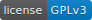

dockerasmus
=======================================
*docking itself through university*

|docs| |gl| |build| |coverage| |license| |grade|

.. |docs| image:: http://readthedocs.org/projects/dockerasmus/badge/?version=latest
   :target: http://dockerasmus.readthedocs.io/en/latest/?badge=latest

.. |build| image:: https://gitlab.com/althonos/dockerasmus/badges/master/build.svg
   :target: https://gitlab.com/althonos/dockerasmus/pipelines?scope=branches

.. |coverage| image:: https://img.shields.io/codecov/c/token/eNxJwF5lhn/gitlab/althonos/dockerasmus.svg
   :target: https://codecov.io/gl/althonos/dockerasmus

.. |grade| image:: https://api.codacy.com/project/badge/Grade/87e03271b04e4154a3b513bddb0d08bc
   :target: https://www.codacy.com/app/althonos/dockerasmus 

``dockerasmus`` is a version-agnostic Python module that was created
to quickly solve docking problems, as part of a Python assignment from
the M1 BIBS of the Université Paris-Saclay.

Dockerasmus provides a generic implementation of a scoring function,
which can be used with several *components* to compute the score of
a docking conformation of two proteins. It is backend agnostic, and
every scoring component can be rewritten with any library supporting
``numpy`` arrays.

.. toctree::
   :maxdepth: 1

   examples
   supported
   api/index

Indices and tables
==================

* :ref:`genindex`
* :ref:`modindex`
* :ref:`search`
